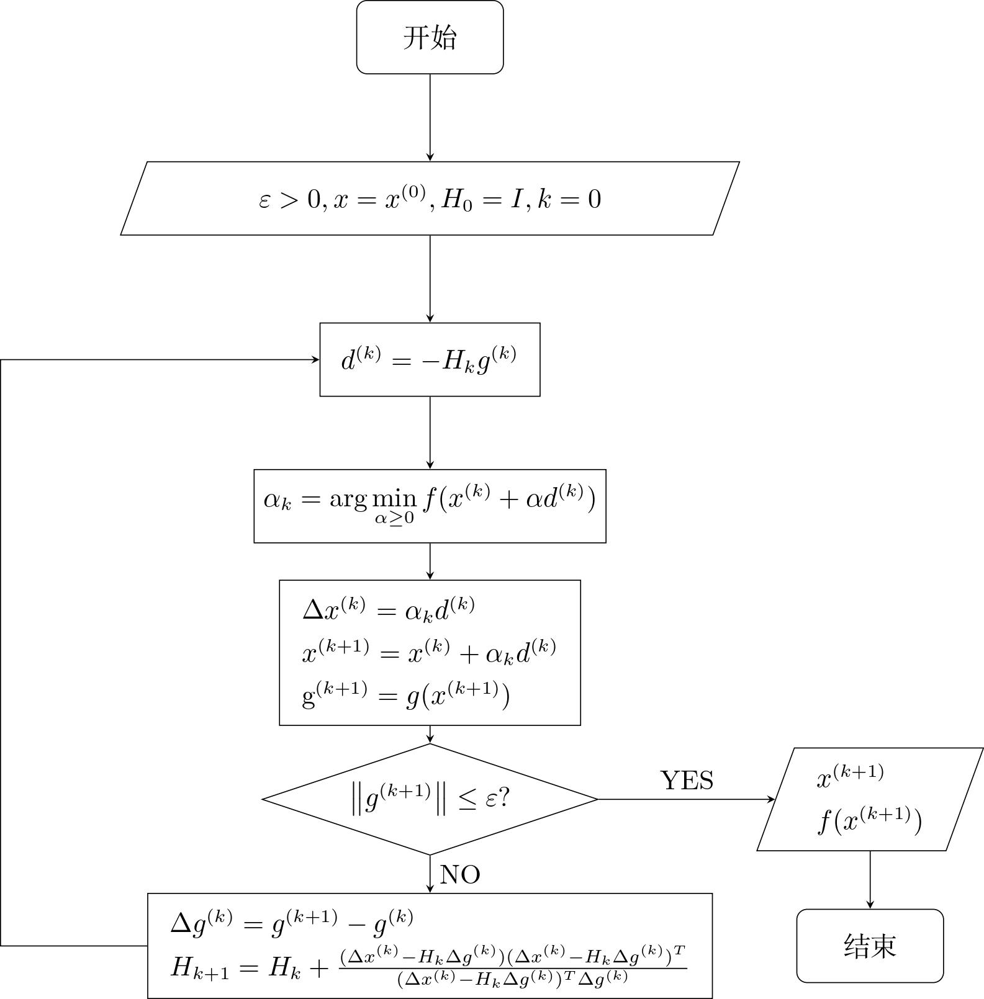
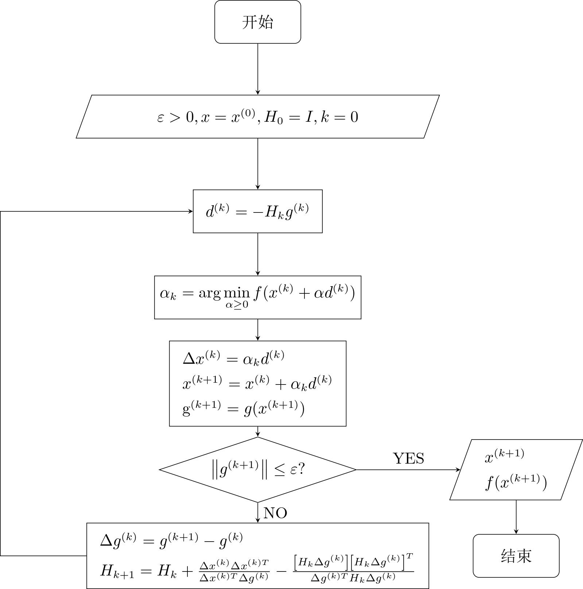
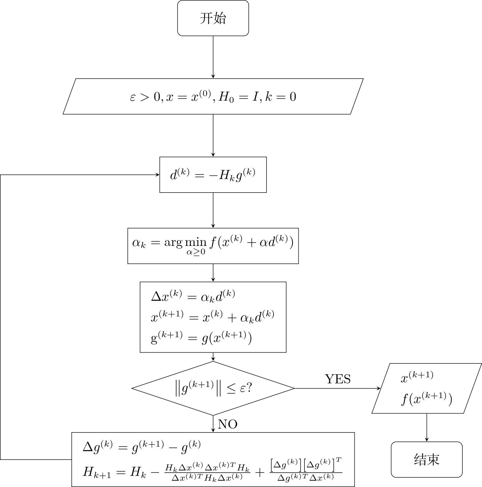
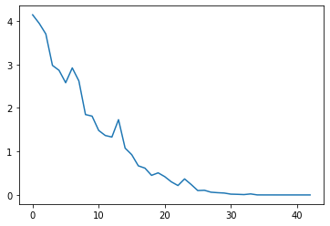
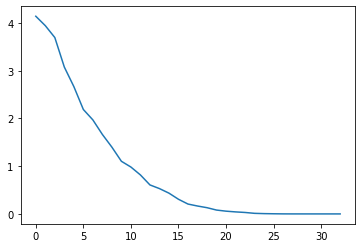
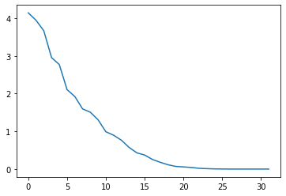
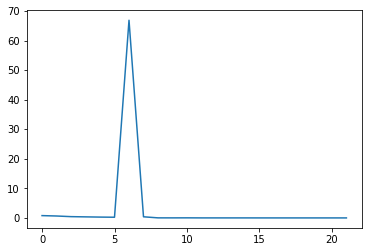
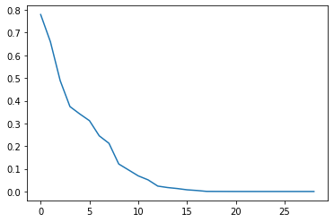
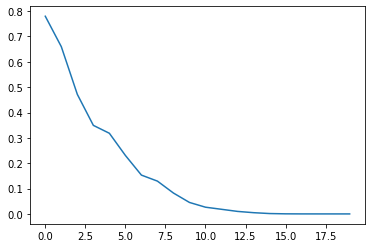

算法实现与求解
--------------

一般的非线性函数（非二次函数）
~~~~~~~~~~~~~~~~~~~~~~~~~~~~~~

.. code:: ipython3

    #coding:UTF-8
     
    from numpy import *
    
    #fun  f(x)=100*(x1^2-x2^2)+(x1-1)^2
    def fun(x):
        return 100 * (x[0,0] ** 2 - x[1,0]) ** 2 + (x[0,0] - 1) ** 2
     
    #gfun g(x)是一个2*1矩阵，第一行第一列是对x1求偏导，第二行第一列是对x2求偏导
    def gfun(x):
        result = zeros((2, 1))
        result[0, 0] = 400 * x[0,0] * (x[0,0] ** 2 - x[1,0]) + 2 * (x[0,0] - 1)
        result[1, 0] = -200 * (x[0,0] ** 2 - x[1,0])
        return result

:math:`min \quad f(x)=100(x_1^2-x_2)^2+(x_1-1)^2`

:math:`g(x)=Df(x)=\begin{bmatrix} 400x_1(x_1^2-x_2)+2(x_1-1) \\ -200(x_1^2-x_2) \end{bmatrix}`

rank1算法
~~~~~~~~~

rank1算法流程图 近似矩阵迭代公式：

:math:`{H_{k + 1}} = {H_k} + \frac{(\Delta {x^{\left( k \right)}}-{H_k}\Delta {g^{\left( k \right)}})(\Delta {x^{\left( k \right)}}-{H_k}\Delta {g^{\left( k \right)}})^T} {(\Delta {x^{\left( k \right)}}-{H_k}\Delta {g^{\left( k \right)}})^T\Delta {g^{\left( k \right)}}}`

   算法流程图

.. code:: ipython3

    def rank1(fun, gfun, x0):
        result = []
        maxk = 500  #最大迭代次数
        rho = 0.55
        sigma = 0.4
        epsilon=1e-5; 
        m = shape(x0)[0]
        Hk = eye(m)
        k = 0
        while (k < maxk):
            gk = mat(gfun(x0))#计算梯度
            dk = -mat(Hk)*gk  #计算搜索方向
            if(np.linalg.norm(gk)<epsilon): #检验终止准则
                break 
            m = 0
            mk = 0
            while (m < 20): # 用Armijo搜索求步长 
                newf = fun(x0 + rho ** m * dk)
                oldf = fun(x0)
                if (newf < oldf + sigma * (rho ** m) * (gk.T * dk)[0,0]):
                    mk = m
                    break
                m = m + 1
            
            #rank1校正
            x = x0 + rho ** mk * dk
            sk = x - x0
            yk = gfun(x) - gk
            Hk = Hk + (sk-Hk*yk) * (sk-Hk*yk).T / ((sk-Hk*yk).T * yk)
            
            k = k + 1
            x0 = x
            result.append(fun(x0))
        
        return result

DFP算法
~~~~~~~

DFP算法流程图 近似矩阵迭代公式：
:math:`{H_{k + 1}} = {H_k} + \frac{{\Delta {x^{\left( k \right)}}\Delta {x^{\left( k \right)T}}}}{{\Delta {x^{\left( k \right)T}}\Delta {g^{\left( k \right)}}}} - \frac{{\left[ {{H_k}\Delta {g^{\left( k \right)}}} \right]{{\left[ {{H_k}\Delta {g^{\left( k \right)}}} \right]}^T}}}{{\Delta {g^{\left( k \right)T}}{H_k}\Delta {g^{\left( k \right)}}}}`

   算法流程图

.. code:: ipython3

    def dfp(fun, gfun, x0):
        result = []
        maxk = 500  #最大迭代次数
        rho = 0.55
        sigma = 0.4
        epsilon=1e-5; 
        m = shape(x0)[0]
        Hk = eye(m)
        k = 0
        while (k < maxk):
            gk = mat(gfun(x0))#计算梯度
            dk = -mat(Hk)*gk
            if(np.linalg.norm(gk)<epsilon): #检验终止准则
                break 
            m = 0
            mk = 0
            while (m < 20):
                newf = fun(x0 + rho ** m * dk)
                oldf = fun(x0)
                if (newf < oldf + sigma * (rho ** m) * (gk.T * dk)[0,0]):
                    mk = m
                    break
                m = m + 1
            
            #DFP校正
            x = x0 + rho ** mk * dk
            sk = x - x0
            yk = gfun(x) - gk
            if (sk.T * yk > 0):
                Hk = Hk - (Hk * yk * yk.T * Hk) / (yk.T * Hk * yk) + (sk * sk.T) / (sk.T * yk)
            
            k = k + 1
            x0 = x
            result.append(fun(x0))
        
        return result

BFGS算法
~~~~~~~~

BFGS算法流程图 近似矩阵迭代公式;
:math:`{H_{k + 1}} = {H_k} - \frac{{H_k}{\Delta {x^{\left( k \right)}}\Delta {x^{\left( k \right)T}}}{H_k}}{{\Delta {x^{\left( k \right)T}}{H_k}\Delta {x^{\left( k \right)}}}} +\frac{{\left[ {\Delta {g^{\left( k \right)}}} \right]{{\left[ {\Delta {g^{\left( k \right)}}} \right]}^T}}}{{\Delta {g^{\left( k \right)T}}\Delta {x^{\left( k \right)}}}}`

   算法流程图

.. code:: ipython3

    def bfgs(fun, gfun, x0):
        result = []
        maxk = 500 #最大迭代次数
        rho = 0.55
        sigma = 0.4
        epsilon=1e-5; 
        m = shape(x0)[0]
        Bk = eye(m)
        k = 0
        while (k < maxk):
            gk = mat(gfun(x0)) #计算梯度
            dk = mat(-linalg.solve(Bk, gk))
            if(np.linalg.norm(gk)<epsilon): #检验终止准则
                break 
            m = 0
            mk = 0
            while (m < 20):   #用Armijo搜索求步长 
                newf = fun(x0 + rho ** m * dk)
                oldf = fun(x0)
                if (newf < oldf + sigma * (rho ** m) * (gk.T * dk)[0,0]):
                    mk = m
                    break
                m = m + 1
            
            #BFGS校正
            x = x0 + rho ** mk * dk
            sk = x - x0
            yk = gfun(x) - gk
            if (yk.T * sk > 0):
                Bk = Bk - (Bk * sk * sk.T * Bk) / (sk.T * Bk * sk) + (yk * yk.T) / (yk.T * sk)
            
            k = k + 1
            x0 = x
            result.append(fun(x0))
        
        return result
    

``result``\ 中记录了每一次迭代的\ ``x``\ 的函数值。\ ``result``\ 中元素的数量即迭代总次数。

算法收敛速度
------------

.. code:: ipython3

    import matplotlib.pyplot as plt  
    import numpy as np
        
    x0 = mat([[-1.2], [1]])
    result = rank1(fun, gfun, x0)
     
    n = len(result)
    ax = plt.figure().add_subplot(111)
    x = arange(0, n, 1)
    y = result
    ax.plot(x,y)
    print (n)
    print (result[n-1])
    plt.show()

.. parsed-literal::

    43
    6.469347536626816e-19
    

.. code:: ipython3

    import matplotlib.pyplot as plt  
    import numpy as np
    
    x0 = mat([[-1.2], [1]])
    result = dfp(fun, gfun, x0)
     
    n = len(result)
    ax = plt.figure().add_subplot(111)
    x = arange(0, n, 1)
    y = result
    ax.plot(x,y)
    print (n)
    print (result[n-1]) 
    plt.show()

.. parsed-literal::

    33
    2.1896368842271688e-16
    

.. code:: ipython3

    import matplotlib.pyplot as plt  
    import numpy as np
    
    x0 = mat([[-1.2], [1]])
    result = bfgs(fun, gfun, x0)
     
    n = len(result)
    ax = plt.figure().add_subplot(111)
    x = arange(0, n, 1)
    y = result
    ax.plot(x,y)
    print (n)
    print (result[n-1])
    plt.show()

.. parsed-literal::

    32
    6.753896559404069e-16
    

+----------+-------+----------+------------------------+
| 初始点   | 算法  | 迭代次数 | 目标函数值             |
+==========+=======+==========+========================+
| [-1.2,0] | rank1 | 43       | 6.469347536626816e-19  |
+----------+-------+----------+------------------------+
| [-1.2,0] | DFP   | 33       | 2.1896368842271688e-16 |
+----------+-------+----------+------------------------+
| [-1.2,0] | BFGS  | 32       | 6.753896559404069e-16  |
+----------+-------+----------+------------------------+

.. code:: matlab

   function [x,val,k]=sr1(fun,gfun, x0)
   %功能: 用对称秩1算法求解无约束问题:  min f(x)
   %输入: x0是初始点, fun, gfun分别是目标函数及其梯度
   %输出:  x, val分别是近似最优点和最优值,  k是迭代次数.
   maxk=500;   %给出最大迭代次数
   rho=0.55;sigma=0.4; epsilon=1e-5; 
   k=0;   n=length(x0); Hk=eye(n); 
   while(k<maxk)
       gk=feval(gfun,x0); %计算梯度
       dk=-Hk*gk; %计算搜索方向
       if(norm(gk)<epsilon), break; end  %检验终止准则
       m=0; mk=0;
       while(m<20)   % 用Armijo搜索求步长 
           if(feval(fun,x0+rho^m*dk)<feval(fun,x0)+sigma*rho^m*gk'*dk)
               mk=m; break;
           end
           m=m+1;
       end
       x=x0+rho^mk*dk;  
       sk=x-x0;  yk=feval(gfun,x)-gk;
       Hk=Hk+(sk-Hk*yk)*(sk-Hk*yk)'/((sk-Hk*yk)'*yk); %秩1校正
       k=k+1;     x0=x;
   end
   val=feval(fun,x0); 

算法的不同
----------

秩1算法的近似矩阵\ :math:`H_k`\ 不都是正定的。
秩2算法可以保证在任意第k步迭代下，只要一维搜索是精确的，近似矩阵\ :math:`H_k`\ 就都是正定的。
如DFP算法和BFGS算法。

利用三种算法求解二次型函数
--------------------------

:math:`min \quad f(x)= \frac{1}{2} x^TQx-x^Tb+log(\pi)`

:math:`Q=\begin{bmatrix} 5 & -3 \\ -3 & 2 \end{bmatrix}`,\ :math:`\quad b=\begin{bmatrix} 0 \\ 1 \end{bmatrix}`

初始点\ :math:`x^(0)=[0,0]^T`

rank1算法
~~~~~~~~~

.. code:: ipython3

    import matplotlib.pyplot as plt  
    import numpy as np
        
    x0 = mat([[0], [0]])
    result = rank1(fun, gfun, x0) 
    n = len(result)
    ax = plt.figure().add_subplot(111)
    x = arange(0, n, 1)
    y = result
    ax.plot(x,y)
    print (n)
    print (result[n-1])
    print (result)   # 迭代中间结果
    plt.show()

.. parsed-literal::

    22
    7.03038991702876e-19
    [0.7796505328309867, 0.647903329132764, 0.43174864447002853, 0.35395519320995333, 0.2790157858586189, 0.2301727452032303, 66.8551930552344, 0.3803419443079954, 0.01919688557291296, 0.014493403655030242, 0.0243827267616587, 0.006523531618577661, 0.004711909032094199, 0.003938932709861242, 0.005944832855606774, 0.00013813269252629403, 2.7062473522404853e-05, 1.1753584996447982e-06, 1.7974047514389684e-07, 4.12580600588475e-11, 4.2697255197291215e-13, 7.03038991702876e-19]
    

DFP算法
~~~~~~~

.. code:: ipython3

    import matplotlib.pyplot as plt  
    import numpy as np
    
    x0 = mat([[0], [0]])
    result = dfp(fun, gfun, x0)
     
    n = len(result)
    ax = plt.figure().add_subplot(111)
    x = arange(0, n, 1)
    y = result
    ax.plot(x,y)
    print (n)
    print (result[n-1])
    print (result)   # 迭代中间结果
    plt.show()

.. parsed-literal::

    29
    7.19219715138461e-17
    [0.7796505328309867, 0.6594092966734678, 0.4884649661302388, 0.37412962490090296, 0.34187217174408696, 0.3120357733196676, 0.2452711477829217, 0.2122170971698485, 0.12114855860725816, 0.09503104273020731, 0.06883922226115423, 0.051367526656193756, 0.023795380641520036, 0.017416572210177308, 0.012996917660099784, 0.007397028905316069, 0.004372484396145824, 0.00047420975648178657, 0.00030087781694019037, 0.00017741503728331413, 6.025114908106955e-05, 2.4188348072428142e-05, 2.6128936793145394e-06, 4.7596994547672995e-07, 4.256328564678119e-08, 1.4857356731312556e-09, 1.8314208202538454e-11, 7.56977430809567e-14, 7.19219715138461e-17]
    

BFGS算法
~~~~~~~~

.. code:: ipython3

    import matplotlib.pyplot as plt  
    import numpy as np
    
    x0 = mat([[0], [0]])
    result = bfgs(fun, gfun, x0)
     
    n = len(result)
    ax = plt.figure().add_subplot(111)
    x = arange(0, n, 1)
    y = result
    ax.plot(x,y)
    print (n)
    print (result[n-1])
    print (result)   # 迭代中间结果
    plt.show()

.. parsed-literal::

    20
    2.20047705066948e-11
    [0.7796505328309867, 0.6595694253943865, 0.47152888012853705, 0.34924438689304865, 0.3180704353850303, 0.23063472651536962, 0.15310047456201717, 0.12936214773849927, 0.08232065702719052, 0.04522341147137615, 0.026501461178135587, 0.018220593494777646, 0.009901412537376825, 0.00486909437034745, 0.0014634459405904923, 0.00033906943140043903, 5.44227522716887e-05, 3.839876322272881e-06, 1.0573888624004621e-07, 2.20047705066948e-11]
    

+--------+-------+----------+----------------------+
| 初始点 | 算法  | 迭代次数 | 目标函数值           |
+========+=======+==========+======================+
| [0,0]  | rank1 | 22       | 7.03038991702876e-19 |
+--------+-------+----------+----------------------+
| [0,0]  | DFP   | 29       | 7.19219715138461e-17 |
+--------+-------+----------+----------------------+
| [0,0]  | BFGS  | 20       | 2.20047705066948e-11 |
+--------+-------+----------+----------------------+

从收敛的图形来看，rank1算法随着迭代，函数值并没有正常减小，而是有一个突变，这可能是中间迭代矩阵不正定引起的。
DFP算法和BFGS算法收敛图形趋势比较正常。

针对rank1算法和BFGS算法的中间结果进行进一步分析。

得到这个异常是在第5次迭代产生的。

异常分析
~~~~~~~~

.. code:: ipython3

    def rank1_test(fun, gfun, x0):
        result = []
        maxk = 500  #最大迭代次数
        rho = 0.55
        sigma = 0.4
        epsilon=1e-5
        m = shape(x0)[0]
        Hk = eye(m)
        print(Hk)
        k = 0
        while (k < maxk):
            gk = mat(gfun(x0))#计算梯度
            dk = -mat(Hk)*gk  #计算搜索方向
            if(np.linalg.norm(gk)<epsilon): #检验终止准则
                break 
            m = 0
            mk = 0
            while (m < 20): # 用Armijo搜索求步长 
                newf = fun(x0 + rho ** m * dk)
                oldf = fun(x0)
                if (newf < oldf + sigma * (rho ** m) * (gk.T * dk)[0,0]):
                    mk = m
                    break
                m = m + 1
            
            #rank1校正
            x = x0 + rho ** mk * dk
            sk = x - x0
            yk = gfun(x) - gk
            Hk = Hk + (sk-Hk*yk) * (sk-Hk*yk).T / ((sk-Hk*yk).T * yk)
            print(Hk)
            print('这是第')
            print(k)
            print('次迭代生成的近似矩阵')
            if(k==5) :
                B=np.linalg.eigvals(Hk)
                print(B)
                if np.all(B>0):
                    print ('正定')
                else:
                    print ('非正定')
            if(k==9):
                B=np.linalg.eigvals(Hk)
                print(B)
                if np.all(B>0):
                    print ('正定')
                else:
                    print ('非正定')
            k = k + 1
            x0 = x
            result.append(fun(x0))
        
        return result

.. code:: ipython3

    import matplotlib.pyplot as plt  
    import numpy as np
        
    x0 = mat([[0], [0]])
    result = rank1_test(fun, gfun, x0) 
    n = len(result)
    ax = plt.figure().add_subplot(111)
    x = arange(0, n, 1)
    y = result
    ax.plot(x,y)
    print (n)
    print (result[n-1])
    print (result)   # 迭代中间结果
    plt.show()

.. parsed-literal::

    [[1. 0.]
     [0. 1.]]
    [[0.86724575 0.33750033]
     [0.33750033 0.14197494]]
    这是第
    0
    次迭代生成的近似矩阵
    [[0.05995369 0.03369757]
     [0.03369757 0.0276469 ]]
    这是第
    1
    次迭代生成的近似矩阵
    [[0.04723135 0.03268716]
     [0.03268716 0.02756666]]
    这是第
    2
    次迭代生成的近似矩阵
    [[0.28485643 0.21368771]
     [0.21368771 0.16543594]]
    这是第
    3
    次迭代生成的近似矩阵
    [[0.1220735  0.10383508]
     [0.10383508 0.09130286]]
    这是第
    4
    次迭代生成的近似矩阵
    [[ 0.09783395  0.15160711]
     [ 0.15160711 -0.0028477 ]]
    这是第
    5
    次迭代生成的近似矩阵
    [ 0.20723953 -0.11225328]
    非正定
    [[0.09789522 0.15556286]
     [0.15556286 0.25256117]]
    这是第
    6
    次迭代生成的近似矩阵
    [[0.09743708 0.15523955]
     [0.15523955 0.252333  ]]
    这是第
    7
    次迭代生成的近似矩阵
    [[0.0970004  0.15408129]
     [0.15408129 0.2492608 ]]
    这是第
    8
    次迭代生成的近似矩阵
    [[-0.1639139  -0.27903183]
     [-0.27903183 -0.4696993 ]]
    这是第
    9
    次迭代生成的近似矩阵
    [ 0.00136778 -0.63498099]
    非正定
    [[0.48213674 0.83287166]
     [0.83287166 1.44397324]]
    这是第
    10
    次迭代生成的近似矩阵
    [[0.39264455 0.68923185]
     [0.68923185 1.21342355]]
    这是第
    11
    次迭代生成的近似矩阵
    [[0.25066573 0.45631128]
     [0.45631128 0.83131029]]
    这是第
    12
    次迭代生成的近似矩阵
    [[0.23548713 0.43465057]
     [0.43465057 0.80039925]]
    这是第
    13
    次迭代生成的近似矩阵
    [[0.31340729 0.60535568]
     [0.60535568 1.17437481]]
    这是第
    14
    次迭代生成的近似矩阵
    [[0.35368114 0.68572018]
     [0.68572018 1.33473825]]
    这是第
    15
    次迭代生成的近似矩阵
    [[0.47146899 0.93304529]
     [0.93304529 1.85405927]]
    这是第
    16
    次迭代生成的近似矩阵
    [[0.38405497 0.77657038]
     [0.77657038 1.57396236]]
    这是第
    17
    次迭代生成的近似矩阵
    [[0.48106364 0.96051536]
     [0.96051536 1.9227534 ]]
    这是第
    18
    次迭代生成的近似矩阵
    [[0.47461    0.94648871]
     [0.94648871 1.89226724]]
    这是第
    19
    次迭代生成的近似矩阵
    [[0.50177928 1.00345234]
     [1.00345234 2.01169826]]
    这是第
    20
    次迭代生成的近似矩阵
    [[0.49983374 0.99968422]
     [0.99968422 2.00440016]]
    这是第
    21
    次迭代生成的近似矩阵
    22
    7.03038991702876e-19
    [0.7796505328309867, 0.647903329132764, 0.43174864447002853, 0.35395519320995333, 0.2790157858586189, 0.2301727452032303, 66.8551930552344, 0.3803419443079954, 0.01919688557291296, 0.014493403655030242, 0.0243827267616587, 0.006523531618577661, 0.004711909032094199, 0.003938932709861242, 0.005944832855606774, 0.00013813269252629403, 2.7062473522404853e-05, 1.1753584996447982e-06, 1.7974047514389684e-07, 4.12580600588475e-11, 4.2697255197291215e-13, 7.03038991702876e-19]
    

由上可知，第5次和第9次迭代产生的都不是正定矩阵。
